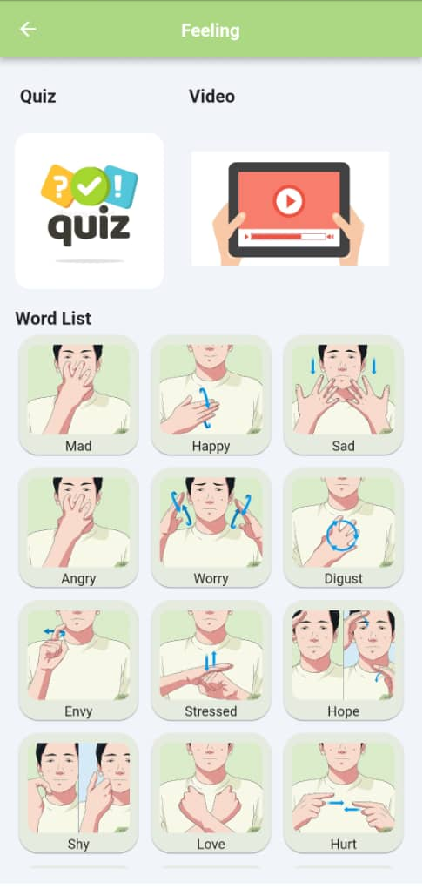
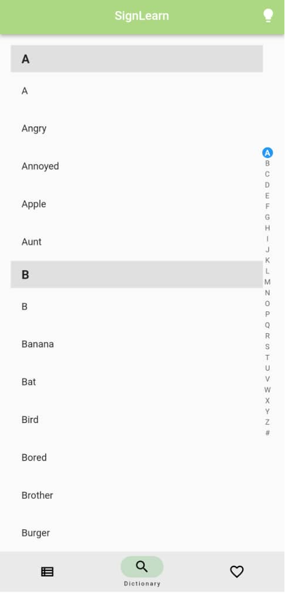
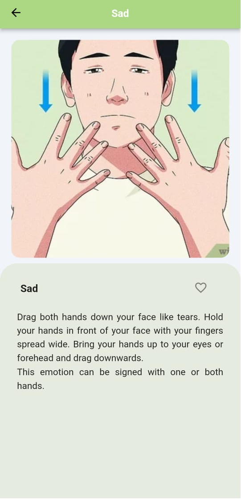
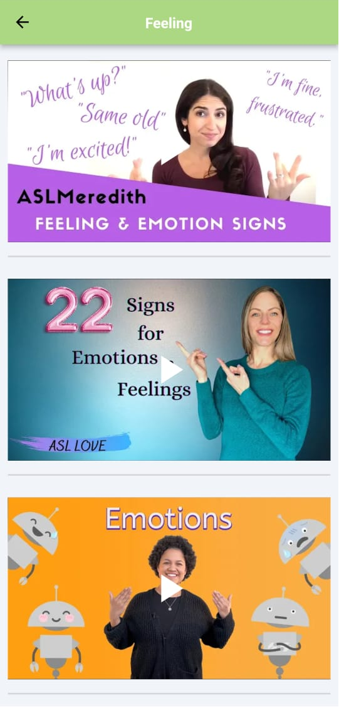
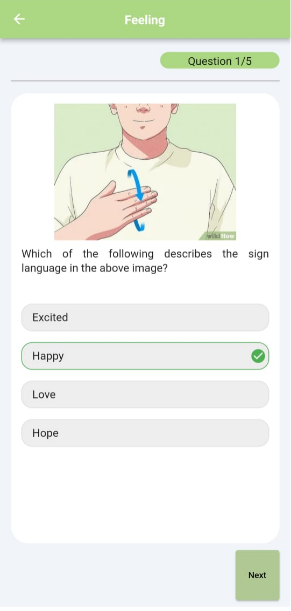
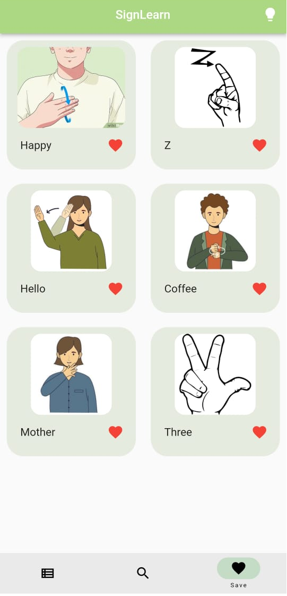
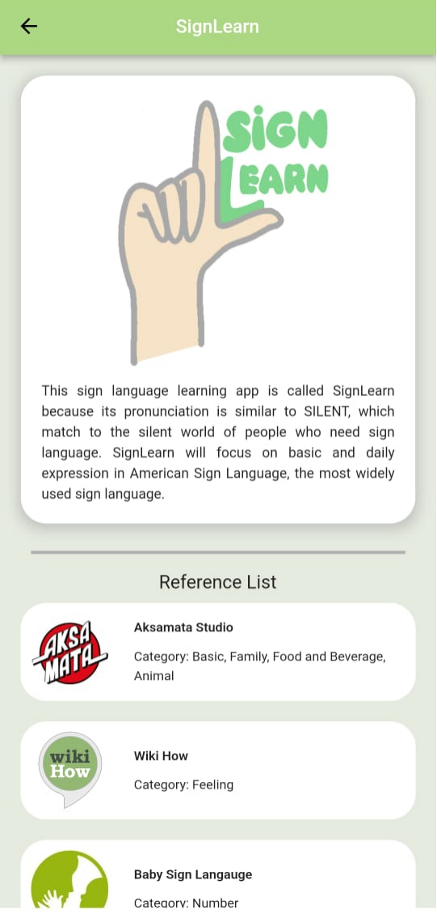

## What is sign language ?

Sign language is the main way that language and hearing-impaired people communicate with other people through finger, shape, position and movement of hand and facial expressions. In reality, most people in society are unfamiliar with sign language and there is a significant communication gap between the deaf or dumb and the public. The lack of resources and difficulty of learning sign language has resulted in many people who are interested in giving up. 

## Introduction

This application for learning sign language named "SignLearn" because its pronunciation is similar to "silent", in line with the silent world of people who generally need sign language, which are people who have hearing loss and are unable to speak. 

The application will focus on teaching basic and daily expression in American Sign Language (ASL), the most widely used sign language. SignLearn is developed in four main stages which are requirements planning, user design (including prototype, refine and test), construction, and cutover. The application was evaluated by 30 respondents of the general public. It can be concluded that the application was successfully delivered, and the results show that the respondents were satisfied with the overall application's features and performance. 

## Highlight
There is no need to be concerned about any security issues because the application does not require the user to login or provide personal information. 

## Features and interfaces

|Feature|
|--|
|**Category** To allow users to learn by the topics |
|**Dictionary** To look up specific words directly |
|**Teaching** |
|**Video** |
|**Quiz** |
|**Save list** |
|**Introduction and reference** |
